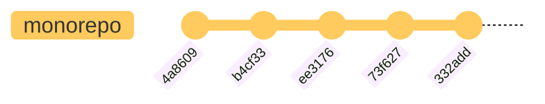
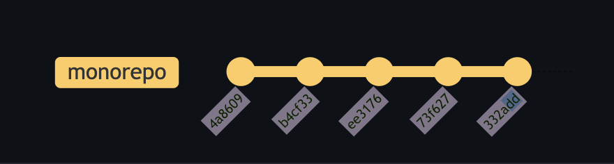
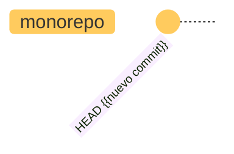
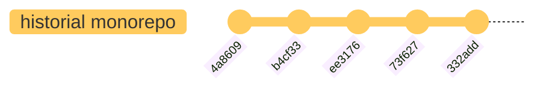
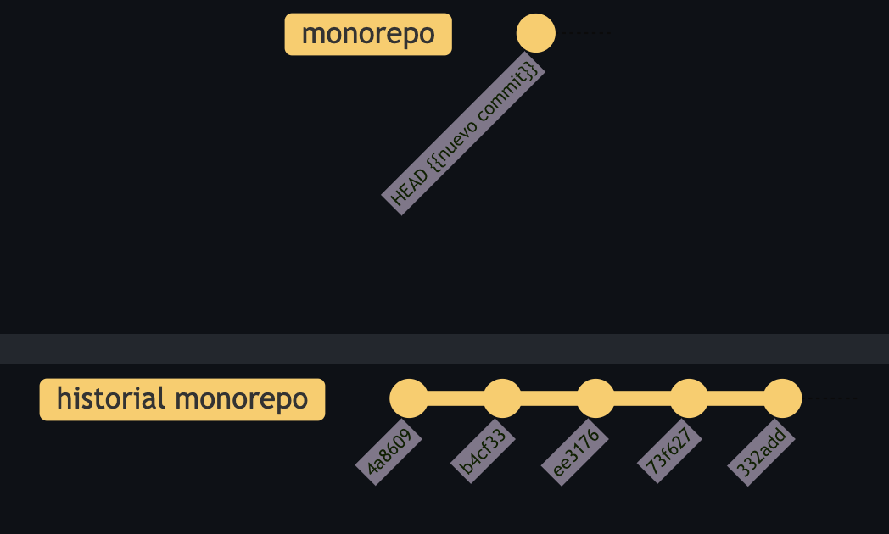
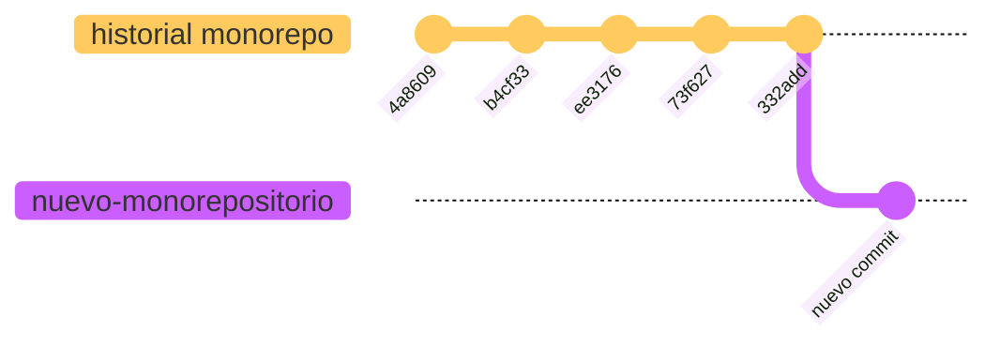
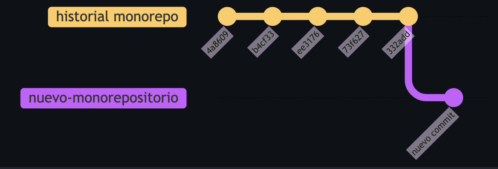
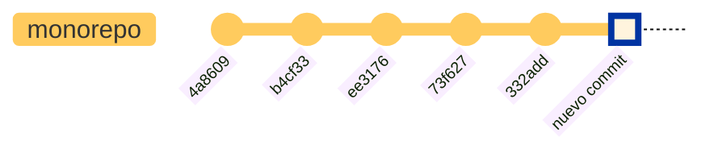
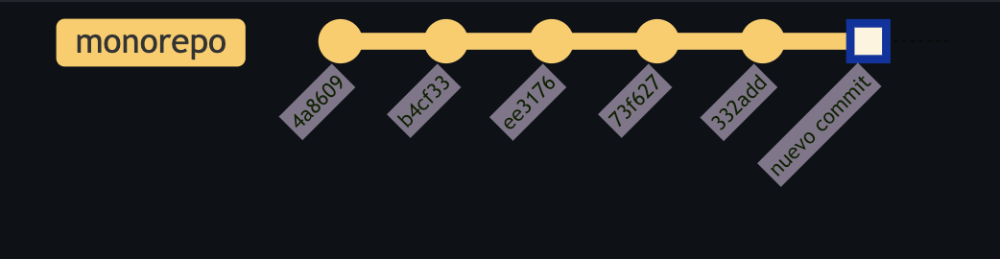

# Grafting un repositorio

Cuando reescribir la historia de nuestro repositorio no es una opción, podemos usar `git replace` para hacer un graft de dos repositorios juntos. Esto nos permitirá mantener un historial archivado de nuestro repositorio y aun asi poder seguir desarrollando en  este repositorio. Este este proceso es hecho usualmente con un clon fresco de nuestro repositorio.

> [!NOTE]
> Grafting en español se traduce literalmente en la palabra __injertar__. En la botánica, es el proceso en el cual se introduce una porción o parte de una planta y esta se une sobre otra planta ya existente. En este contexto, estamos injertando dos repositorios juntos.

## Git replace

Reescribir el historial de un repositorio puede ser muy costoso, consume mucho tiempo y no siempre es la solución correcta. Una organización puede estar tan fuertemente invertida en su monorepositorio, que una reescribir la historia de un repositorio es poco probable. En este caso, `git replace` es una herramienta util para retener el historial del repositorio. Dándole un SHA de un commit en particular, te permite reemplazar un commit en el historial con otro commit.

```bash
git replace --graft <commit> [<parent>…​]
```

Este comando create un graft commit. Un nuevo commit es creado con el mismo contenido que `<commit>` excepto que sus padres serán `[<parent>…​]` en lugar de los padres de `<commit>`. Un ref de reemplazo es creado para reemplazar `<commit>` con el nuevo commit creado.
Podemos usar `--convert-graft-file` para convertir un archivo `$GIT_DIR/info/grafts` y reemplazar refs en su lugar.

Como podemos hacer este proceso con nuestro monorepositorio? Ya que no queremos reescribir la historia, podemos crear dos copias del repositorio, una conteniendo toda el historial y la otra con el `HEAD` del repositorio histórico y cualquier otro commit futuro. Con este enfoque, el repositorio histórico permanecerá intacto (solo lectura) y el nuevo repositorio sera usado para todo desarrollo futuro.



<details><summary> Backup (imagen)</summary>


</details>

## Proceso

Nuestro primer paso es copiar nuestro monorepositorio en un nuevo directorio. Usaremos uno como el repositorio histórico y el otro como el repositorio futuro.

```bash
cp -r /source/mal-monorepositorio /source/mal-monorepositorio-historial
```

Ahora, vamos a crear nuestro "nuevo" repositorio donde se llevara a cabo el desarrollo futuro (mal-monorepositorio), y lo crearemos como un nuevo repositorio con el commit base como el `HEAD` del repositorio histórico. El método mas fácil y simple de hacer esto es eliminar nuestro directorio `.git`, y re-inicializarlo como un nuevo repositorio git. Podemos hacer esto ejecutando los siguientes comandos:

```bash
cd /source/mal-monorepositorio
rm -rf .git
git init
```

Después vamos a agregar y hacer commit a todos los nuevos archivos a nuestro nuevo repositorio. Recuerda, este es el nuevo punto de inicio para todo desarrollo futuro, asi que es una buena idea dejar un rastro del repositorio histórico. Podemos hacer esto agregando un mensaje de commit que haga referencia al repositorio histórico.

```bash
git add --all
git commit -m "Primer commit de el monorepositorio. Puedes encontrar todo el historial de el repositorio aquí https://github.com/amenocal/monorepositorio"
```

Una vez completado, ahora tenemos dos repositorios diferentes, uno con solo 1 commit y otro con la replica del monorepositorio con todo el historial.





<details><summary> Backup (imagen)</summary>


</details>

Ahora que ya tenemos un nuevo repositorio, podemos agregar nuestro repositorio histórico como un remoto y traer el historial de el:

>[!NOTE]
> En este caso vamos a usar una copia local del monorepositorio histórico, pero en un entorno de producción, lo recomendado es que hagas el `fetch` de un repositorio remoto(origin) alojado por un proveedor de servicios de terceros(como GitHub).

```bash
git remote add historial ../mal-monorepositorio-historial
git fetch historial
```

A este punto, todavía deberíamos de tener solo un commit en nuestro repositorio. Podemos verificar esto ejecutando `git log`:

```bash
git --no-pager log --oneline
```

Pero deberíamos ver nuestro repositorio histórico listado como un origen remoto. Podemos verificar esto ejecutando:

```bash
git remote -v
```

También deberiamos de ver los archivos HEAD tanto locales y como los fetch, y estos deberian de ser identicos (pero no necesariamiente tienen que ser iguales).

```bash
git ls-tree --name-only -r HEAD
git ls-tree --name-only -r FETCH_HEAD
```

Finalmente, podemos hacer graft el FETCH_HEAD a el HEAD de nuestro monorepositorio.



<details><summary> Backup (imagen)</summary>


</details>

Esto lo podemos hacer con `git replace` con el siguiente comando:

```bash
git replace --graft HEAD FETCH_HEAD
```

> [!NOTE]
> En nuestro ejemplo, usamos HEAD como el primer commit en el repositorio histórico, pero es recomendado reemplazar HEAD con el SHA del primer commit en el nuevo repositorio.
>
> ```bash
> git replace --graft <nuevo-commit> FETCH_HEAD
> ```

El repositrio ahora deberia de aparecer como un solo repositorio con todo el historial del monorepositorio.



<details><summary> Backup (imagen)</summary>


</details>

Al correr `git log` debería de mostrar correctamente el ultimo commit junto con todo el historial del monorepositorio. también deberíamos de poder ver el commit exacto donde el graft fue hecho en el repositorio.

```bash
git --no-pager log --oneline
```

<details><summary>Output</summary>

```bash
b6f65f59 (HEAD -> main, replaced, origin/main) Primer commit de el monorepositorio. Puedes encontrar todo el historial de el repositorio aqui https://github.com/amenocal/monorepositorio
332addd (historial/main) removiendo backup
73f627b usando fmt para imprimir mensaje
ee31768 Merge pull request #1 from amenocal/amenocal/README
b4cf337 agregar README
4a86093 imprimir el mensaje
4fa2962 mensaje
d56d6b4 init cli
f9a40dc Initial commit
```

</details>

También podemos verificar que los commits están siendo correctamente agregados al nuevo repositorio, y no al histórico:

```bash
git commit --allow-empty -m "Empty commit"
git log --oneline | head -n 10
```

## Conclusion

Como se menciono, grafting de un repositorio con `git replace` es una técnica util para preservar el historial de un monorepositorio mientras se mantiene el desarrollo futuro. La mayoría de las veces, los sistemas de control de versiones proveerán una manera de archivar o establecer el estado del repositorio como "read only". Grafting permite a los usuarios integrar sin problemas el historial archivado en un nuevo repositorio. Y con esto, hemos exitosamente hecho grating en nuestros repositorios y concluido la ultima actividad! 🎉 🎉  

:arrow_backward: [Back to Main](../README.md)
